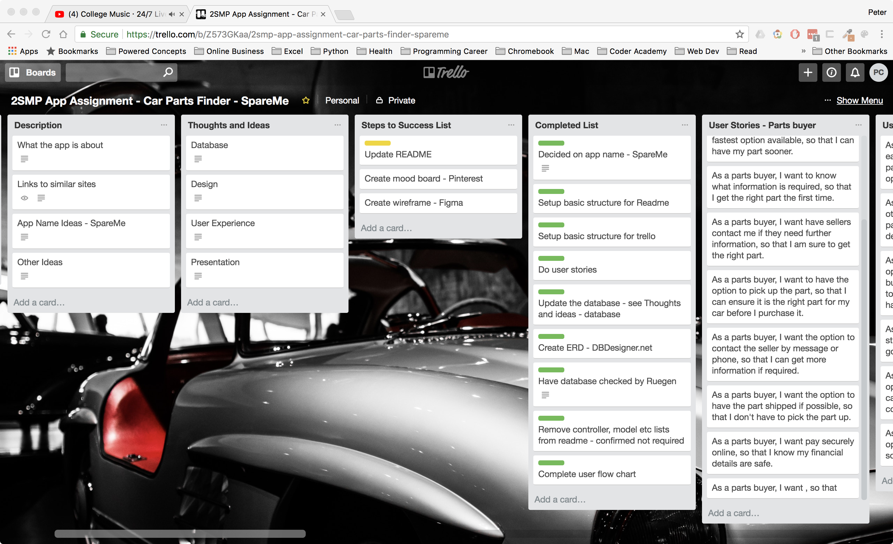
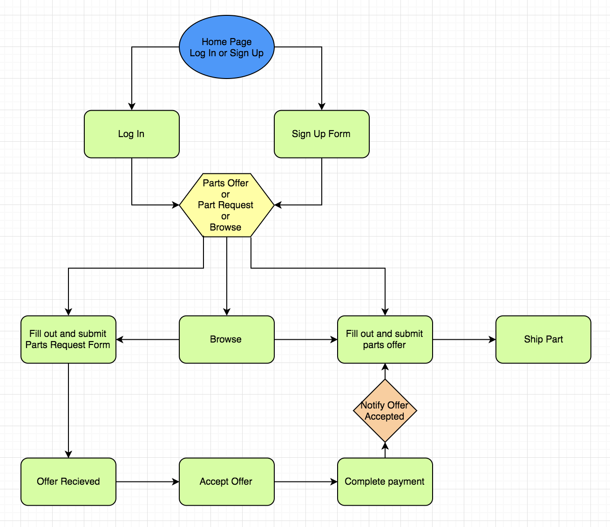
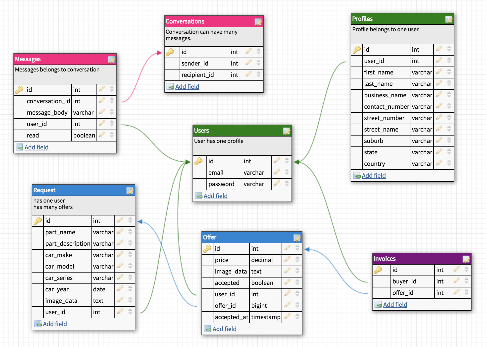
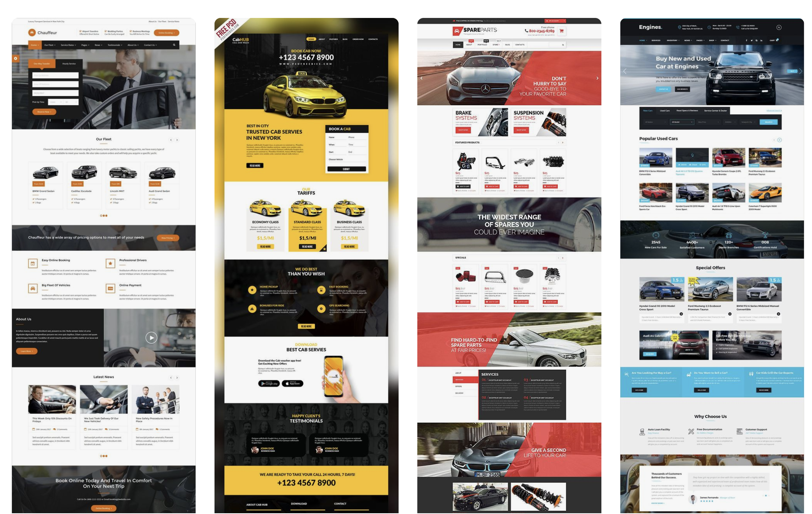
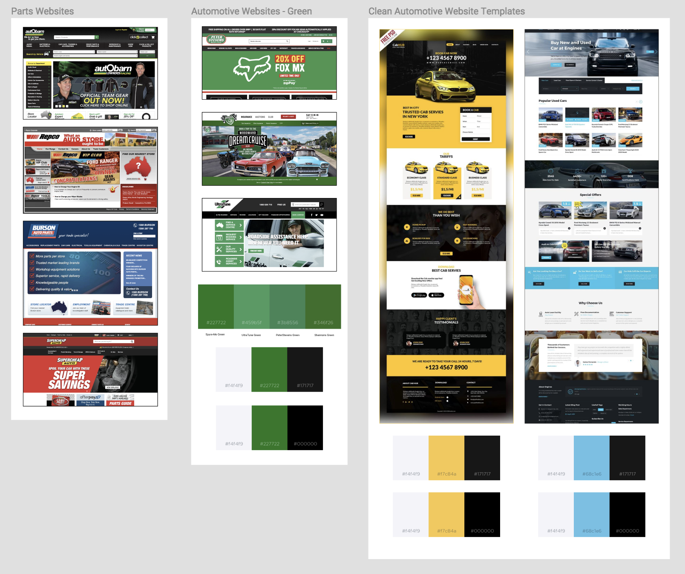
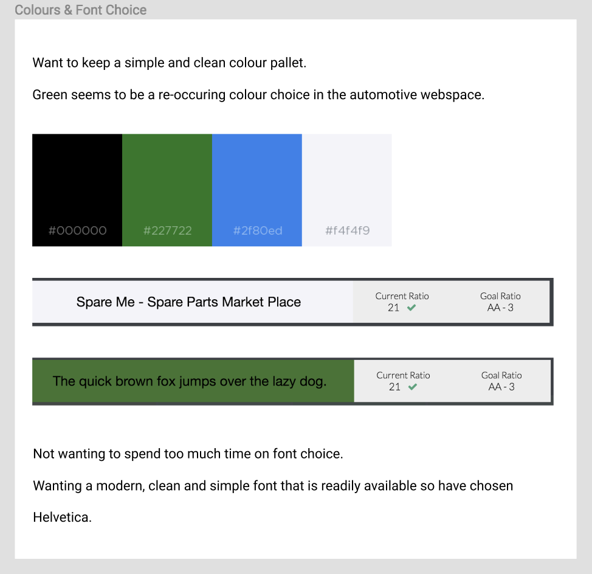
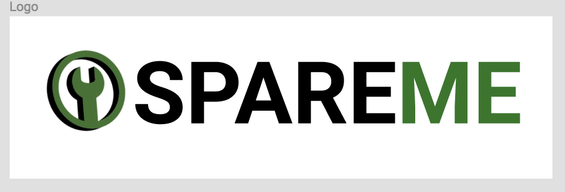
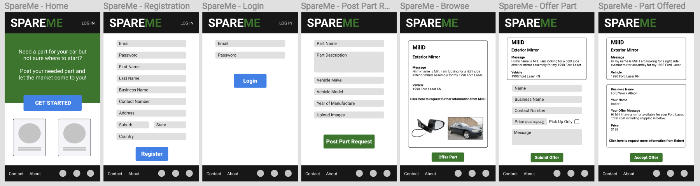
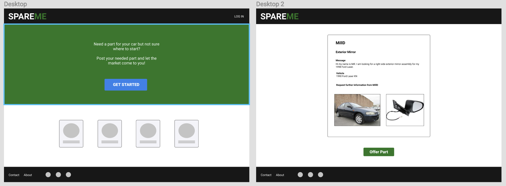

# SpareMe - Car Spare Parts Marketplace
## https://serene-temple-28659.herokuapp.com/
SpareMe is a community oriented, two sided marketplace for car enthusiasts, automotive professionals and the everyday car repair do it yourself-er. The main idea behind SpareMe is to remove the pain of searching for car spare parts, instead having the spare parts market come to you.

## Contents
**[Problem](#Problem)**\
**[Solution](#Solution)**\
**[Trello Board](#Trello-Board)**\
**[User Stories](#User-Stories)**\
**[Personas](#Personas)**\
**[User Workflow](#User-Workflow)**\
**[Entity Relationship Diagram](#ERD)**\
**[Mood Board](#Mood-Board)**\
**[Logo](#Logo)**\
**[Wireframes](#Wireframes)**\
**[Ruby Gems](#Ruby-Gems)**\
**[Challenges](#Challenges)**\
**[Code Review](#Code-Review)**\
**[Future Development and Improvements](#Future-Development-and-Improvements)**\

## Problem
Finding specific car parts new or used can be an expensive, time consuming and difficult process. 
- New parts from local dealers are usually convenient but overpriced. 
- Used parts aren't always local and can be hard to find. 

## Solution
SpareMe will provide a platform for parts buyers and sellers to interact, however it does so in a bit of a backwards way.
- Parts buyers can log in and post their spare parts requests.
- Parts sellers can log in and browse the posted spare parts requests and offer a sale to the parts requestors.

## Trello Board
My trello board is the main driver of my project management. It allowed me to plan ahead with User Stories, User Workflow, Models, Controllers, ERD and Wireframes. Most importantly Trello enabled me to keep track of my progress by setting myself tasks and marking them as in progress, complete or need help. A link to my Trello board is included below.

[Trello Board - SpareMe - Car Spare Parts Seeker](https://trello.com/b/Z573GKaa)

## User Stories
My user stories are composed of 3 target markets (Buyers, Sellers and Guests). Guests are those who have not signed in but as potential buyers and sellers can browse the already requested spare parts posts. Buyers and Sellers are the registered users who can benefit from all the features of the site. Also, since it is a two-sided marketplace, a buyer can be a seller and a seller can be a buyer.

### Buyers
- As a parts buyer, I want to find a part for my car online, so that I don't have to drive all over town.
- As a parts buyer, I want to choose the cheapest option available, so that I can save money.
- As a parts buyer, I want choose the fastest option available, so that I can have my part sooner.
- As a parts buyer, I want to know what information is required, so that I get the right part the first time.
- As a parts buyer, I want have sellers contact me if they need further information, so that I am sure to get the right part.
- As a parts buyer, I want to have the option to pick up the part, so that I can ensure it is the right part for my car before I purchase it.
- As a parts buyer, I want the option to contact the seller by message or phone, so that I can get more information if required.
- As a parts buyer, I want the option to have the part shipped if possible, so that I don't have to pick the part up.
- As a parts buyer, I want pay securely online, so that I know my financial details are safe.

### Sellers
- As a parts seller, I want to be able to easily search through people seeking parts, so that I can give them the option to buy my parts.
- As a parts seller, I want to see what other offers have been posted to the parts buyer, so that I can offer a better deal if I am able to.
- As a parts seller, I want to have the option to post the item or have the buyer pick it up, so that I don't have to try and post things that are too hard to ship.
- As a parts seller, I want to get paid straight away, so that I know I am not going to lose money.
- As a parts seller, I want to have the option to contact the buyer, so that I can ensure I am sending them the correct part for their car.
- As a parts seller, I want to have the option to list my businesses details, so that users can see who I am.

### Guests
- As a guest, I would like to easily sign up if I see a part I need, so that I can buy that part.
- As a guest, I want to browse parts that have been listed for sale, so that I can make the purchase without having to post as a buyer.
- As a guest, I would like to enter my car details, so that I can see what is currently available to buy for my car.

## Personas
### As a Buyer
__Racheal__
drives a 2001 model Mercedes Benz C200. She lives on a busy suburban road and parks her car on the street. Racheal came out to her car one morning and found the drivers side mirror had been broken off by someone overnight. Rachael rang the local dealership to find that a new exterior mirror will cost her $498. Not wanting to spend that much money Racheal logs onto SpareMe, posts the details of her car and required part and waits for a reply from a parts supplier.

__Larry__
restores cars as a hobby and is currently restoring a 1982 Holden Torana. Parts are available but not too easy to come by. Larry has created a profile on SpareMe and constantly posts any parts that he needs.

### As a Seller
__Bill__
owns a car wrecking business specialising in Alfa Romeo's catering to a specialised market. Due to the niche business is sometimes slow. Bill has created a business profile on SpareMe and logs in daily to check for anyone requesting parts for their Alfa that he may be able to post an offer on.

__Robert__
was driving a 2004 Ford Falcon BA. He hadn't had the car serviced for years and as a result the engine blew. Instead of spending the thousands to repair the car Robert has decided to strip the car and sell it for parts. Rob creates a seller profile on SpareMe and keeps a watch out for anyone needing some BA parts.

## User Workflow

__Registration__
- User clicks on get started.
- View moves to registration page.
- User completes registration form.
- User clicks register.
- View moves to home page.

__Buyer__
- Clicks on post a required part.
- Buyer fills out part request form.
- Form must include the following:
  - part title
  - part description
  - car make, model and year
  - prompt in description to include colour, side of vehicle,
at least two photos, one of car, one of part
- Buyer clicks on list past.
- Message received on screen to confirm post submitted.
- Buyer redirected to home screen.

__Seller__
- Browses parts required posts
- Clicks on offer part.
- Seller is redirected to part offer screen.
- Top of screen contains part required post info.
- Remainder of page contains part offer form.
- Option for seller to send message to requestor for further information. (mailgun)
- Seller completes form.
- Seller clicks on send offer.
- Seller sees onscreen notification that offer has been submitted and email will be sent if offer accepted. (mailgun)
- Seller redirected to home page.

__Buyer Offer Page__
- Buyer receives email notification that part offer has been received.
- Buyer logs in.
- Buyer is redirected to his profile page.
- Profile page includes part request information.
- Profile page includes part offer information including map of business location if part marked as pick up. (add to database)
- Button to reject offer.
- If rejected seller is sent email.
- If rejected offer is removed.
- Button to accept offer.
- If accepted buyer is redirected to payment.
- Buyer completes payment.
- Buyer is redirected to home screen.

## ERD
The ERD is the most critical part of my design and is essentially one of the biggest things I have done for my project. Planning my tables ahead gave me an idea of how I want to work with my Rails models however the ERD plan was revisted and reconfigured several times during the build process.

| INITIAL ERD DESIGN | FINAL ERD DESIGN |
| ------------------ | ------------------|
| __Users__          | __Users__
| - id               | - id
| - username         | - username 
| - password         | - password
|                    | - stripe_id
| __Profiles__       | __Profiles__
| - id               | - id              
| - user_id          | - user_id         
| - first_name       | - first_name      
| - last_name        | - last_name       
| - business_name    | - business_name   
| - phone_number     | - business_number    
| - house_number     | - street_number    
| - street_name      | - street_name     
| - suburb           | - suburb          
| - state            | - state           
| - postcode         | - postcode        
| - country          | - country         
| - country_code     | 
| - latitude         |  
| - longitude        | 
| __Part Requests__  | __Requests__ 
| - id               | - id              
| - user_id          | - user_id         
| - part_name        | - part_name       
| - part_description | - part_description
| - make             | - make            
| - model            | - model           
| - series           | - series          
| - year             | - year            
| - offered_at       | - image_data    
| - offered_by       |   
| - accepted_by      |  
| __Part Offerings__ | __Offers__
| - id               | - id              
| - user_id          | - user_id         
| - parts_request_id | - request_id
| - price            | - message        
| - approved_at      | - price 
| - approved         | - image_data       
| - part_name        | - accepted
| - part_description | 
| - make             |             
| - model            |            
| - series           |           
| - year             |             
| - offered_at       |       
| - offered_by       |       
| __Invoices__       | __Invoices__      
| - id               | - id              
| - buyer_id         | - buyer_id        
| - part_offering_id | - part_offering_id
| __Messages__       |  
| - id               |  
| - conversation_id  |  
| - user_id          |  
| - message_body     |  
| - read             |  
| __Conversations__  |  
| - id               |  
| - sender_id        |  
| - recipient_id     |  

__Relationships__
- profiles belong to users and users have one profile
- requests belong to users and users have many requests
- offers belongs to users and users has many offers
- offers belong to requests and requests has many offers

 
  

**[Back to Contents](#Contents)**

## Mood Board
For some color design direction I browsed through websites of some of the major car parts retail chains in Australia. Repco, Autobarn, Burson and Supercheap Auto. The main colour themes are black and red.

For something different I looked at other mainstream automotive businesses. Shannons Insurance, Peter Stevens and UltraTune. The main colour theme from these sites is Green and White.

I liked the Green, Black, White combination so looked at some different options along these lines as can be seen in the Figma design board.

Overall I am aiming for a minimal, clean design. I found some examples of designs I liked on pinterest.

[Link to Pinterest](https://pin.it/6pnff44js7yqvw)

Pinterest mood board

[Link to Figma](https://www.figma.com/file/RXCZRqddfEexjEAer8ezEATZ/SpareMe)

Figma mood board

## Colours and Font Choice

## Logo
The site logo is a simple spanner in a circle to symbolise repairs.
The Spare Me site name text is not spaced but the words differentiated by a colour change.

## Wireframes

### Mobile

### Desktop

## Ruby Gems
Gems added to the project.
- devise
- pundit
- stripe
- shrine
- mailgun-ruby
- faker
- rspec-rails
- dotenv-rails

Shrine dependencies
- mini_magick
- image_processing
- aws-sdk-s3

## Challenges
- Getting the ERD right and understanding the relationships was difficult at the start. There were several revisits and changes made to the ERD during the build process.
- Couldn't get the search function to work. The search request shows up in the parameters but the search result is not returned.
- Pushing to Heroku. There were several steps required and several push attempts to get the site live on Heroku. Even after the site push was successful the site still is not fully functioning on Heroku as it does locally. The sign up and create an offer functions are not working on Heroku.
- Even though I am happy with the outcome of the MVP, overall the whole coding process was a battle. It seemed like a two steps forward, ten steps back journey however the amount of learning was enormous.

## Code Review
There were several fellow students who assisted with code reviews and help. Barbara, Meng, Mill, Cameo, Maxi, Richard, Chris, AJ and many more. Thank you to all for your assistance.

## Future Development and Improvements
- Add direct messaging function between buyers and sellers.
- Add the ability to upload several images for a parts request.
- Add the ability to upload and when offering a part.
- Make images responsive.
- Part requestor is notified when a parts offer is recieved, within app and via email.
- Part offerer is notified when a part offer is accepted and purchased, within app and via email.
- Add the favicon.

[Back to Contents](#Contents)